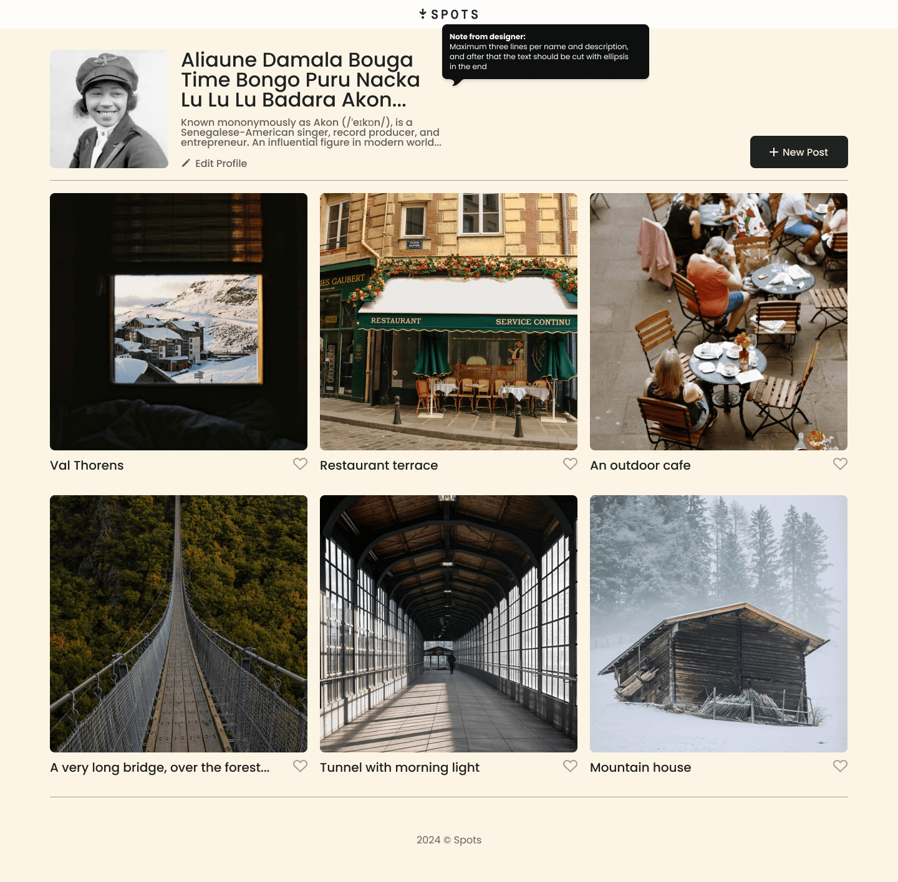
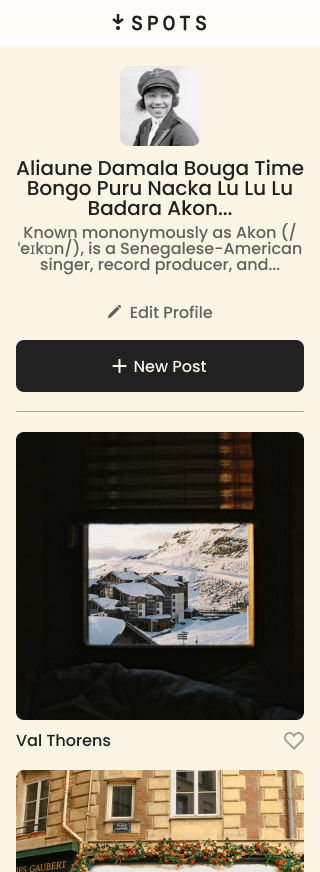

# Project 3: Spots

**Intro**

Spots is a website that shows a photogallery that is supported by responsive design. Functionality includes grid, flexbox, media queries, and psuedo classes (e.g., hover).

**Technologies and Techniques Used**

- Figma
- HTML5,
- CSS3 (flexbox, grid, media queries, psuedo classes,)
- BEM methodology

**Images**

**Links**

- Deployed Project [link](https://vochoa44.github.io/se_project_spots/)
- Project Pitch [link](https://www.loom.com/share/0a0ed6805284478cbec72c885f19ea6c)
